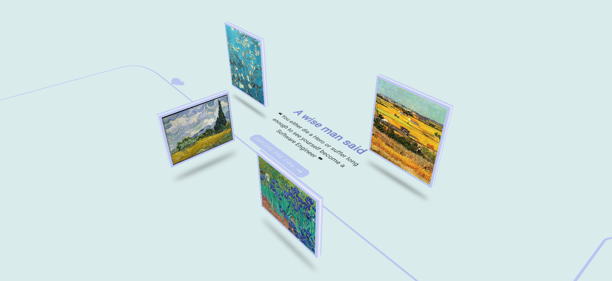

# exhibition_3d

🔗[https://exhibition-3d.vercel.app](https://exhibition-3d.vercel.app/)

### 🖼️ 3D image exhibition

    I dig into a `3D` world using only Flutter built-in widgets. It's pretty cool and fun although there are some flaws like interacting with 3D objects.

### 🧮 Why `3D` with `2D` Widgets?

- It's a lot heavy to load and render `3D models` in Flutter and frame rates may drop. So, it might be more performant to use built-in widgets to represent simple 3D models ( although it requires a lot of calculations )
- I wanna test the limitations and drawbacks of Flutter's built-in widgets in `3D` space
- The main reason is because I'm a bit curious about it 😏

### 🕸️ Where is the reference? 
My reference website is [https://ourheritage.novonordisk.com/](https://ourheritage.novonordisk.com/). I really love that although it makes my computer lagged while loading 🥲.

### ⚒️ Tools
    I only use Flutter web and svg images. Nothing more.

### 💭 Final Thoughts
    Just use `Rive`. That's the best option.
### 👀Sneak Peek

    Here's my website preview. 

**🌟 Don't forget to give it a really big Star and follow me coz it pushes me to write more open-source projects. Otherwise, I'm as lazy as a sloth.🦥**